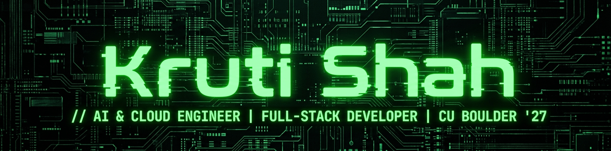

<div align="center">

  <!-- Banner -->
  

  <br/><br/>

  <!-- Headline & Badges -->
  <h1>Hi there, I'm <span style="color: #00FF66;">Kruti Shah</span> 👋</h1>
  <p><strong>AI & Cloud Engineer • Full-Stack Developer • M.S. CS @ CU Boulder ('27)</strong></p>

  <!-- Connect & Social Badges -->
  <p align="center">
    <a href="https://krutishah.netlify.app/" target="_blank">
      
    </a>
    &nbsp;
    <a href="https://www.linkedin.com/in/kruti-shah-cs95" target="_blank">
      
    </a>
    &nbsp;
    <a href="https://github.com/kruti002" target="_blank">
      
    </a>
    &nbsp;
    <a href="https://leetcode.com/u/krsh5844/" target="_blank">
      
    </a>
    &nbsp;
    <a href="mailto:shahkruti957@gmail.com">
      
    </a>
  </p>

  <!-- GitHub Trophy Badges -->
  <p align="center">
    
  </p>

</div>

<br/>

---

### ⚡ `whoami`

```bash
$ cat kruti_profile.json
{
  "name": "Kruti Shah",
  "location": "Boulder, CO, USA",
  "education": [
    "M.S. in Computer Science — University of Colorado Boulder (GPA: 3.76/4.0)",
    "B.Tech in Computer Engineering (Honors in Intelligent Computing) — DJSCE (GPA: 9.05/10.0)"
  ],
  "experience": [
    "Agentic AI Intern @ eClerx (LangGraph, Claude, RAG financial reasoning pipelines)",
    "AI Intern @ Assessli (Deep Reinforcement Learning & automated assessment)",
    "Python Intern @ Emkay Global (Real-time algorithmic trading alerts & LSTM models)"
  ],
  "patents_and_publications": [
    "Utility Patent Published: HazardScout IoT Gas Leakage Detection Robot (No. 202521045231)",
    "Explainable AI for Yoga Pose Detection and Correction (2024)",
    "EcoBot: Pest Detection Alert System (Book Chapter, 2026)"
  ],
  "recognition": [
    "Top 70 finalist out of 29,000+ teams in Myntra HackerRamp WeForShe 2024",
    "Selected for JPMorgan Chase College to Corporate Program (Top 60 cross-dept)"
  ]
}
```

---

### 🛠️ Tech Stack & Arsenal

<div align="center">

#### 🤖 AI, Machine Learning & Intelligent Systems
<p>
  
  
  
  
  
  
  
  
  
</p>

#### 💻 Programming Languages
<p>
  
  
  
  
  
  
  
</p>

#### 🌐 Full-Stack & Web Development
<p>
  
  
  
  
  
  
  
</p>

#### ☁️ Cloud, DevOps & Databases
<p>
  
  
  
  
  
  
  
</p>

</div>

---

### 🚀 Featured Projects

<table>
  <tr>
    <td width="50%">
      <h3 align="center">📦 ChronoBase</h3>
      <p align="center"><strong>Git for Databases • Cloud-Native Data Versioning</strong></p>
      <p>A full-stack data versioning platform enabling snapshotting, branching, and restoration across database states. Built with microservices on AWS EC2, S3, SQS, EventBridge, and DocumentDB with multi-tenant encryption.</p>
      <p align="center">
        <code>AWS</code> • <code>DocumentDB</code> • <code>Node.js</code> • <code>MongoDB</code> • <code>SQS</code>
      </p>
      <p align="center">
        <a href="https://github.com/kruti002/ChronoBase"><b>View Repository ➔</b></a>
      </p>
    </td>
    <td width="50%">
      <h3 align="center">🗺️ BoulderMove</h3>
      <p align="center"><strong>Multimodal Trip Planner & ML Arrival Prediction</strong></p>
      <p>Cloud-native transit routing combining GTFS/RAPTOR and OSMnx routing with XGBoost ML inference on GCP Cloud Run (87% arrival accuracy), integrated with Gemini & OpenWeather APIs.</p>
      <p align="center">
        <code>FastAPI</code> • <code>React</code> • <code>GCP Cloud Run</code> • <code>XGBoost</code> • <code>Gemini API</code>
      </p>
      <p align="center">
        <a href="https://github.com/kruti002/bouldermove_dcsc"><b>View Repository ➔</b></a>
      </p>
    </td>
  </tr>
  <tr>
    <td width="50%">
      <h3 align="center">👗 Style Sync</h3>
      <p align="center"><strong>AI Fashion Personalization & 3D Virtual Try-On (Myntra HackerRamp)</strong></p>
      <p>Top 70 / 29,000+ national finalist project. Built 3D virtual try-on pipelines integrating DRM, MTM, and TFM models with VGG19 feature extraction, skin-tone matching (MTCNN + Dlib), and ResNet-50 recommender.</p>
      <p align="center">
        <code>PyTorch</code> • <code>OpenCV</code> • <code>VGG19</code> • <code>MTCNN</code> • <code>ResNet50</code>
      </p>
      <p align="center">
        <a href="https://github.com/kruti002/Myntra-Hackerramp"><b>View Repository ➔</b></a>
      </p>
    </td>
    <td width="50%">
      <h3 align="center">🛡️ Agentic Security Pipeline</h3>
      <p align="center"><strong>LLM-Powered Code Vulnerability Analysis</strong></p>
      <p>Automated static and dynamic vulnerability analysis pipeline utilizing multi-agent LLM reasoning to detect code security flaws and suggest contextual security patches.</p>
      <p align="center">
        <code>Python</code> • <code>LangChain</code> • <code>Agentic AI</code> • <code>AWS</code>
      </p>
      <p align="center">
        <a href="https://github.com/kruti002/Secuirity_Pipeline_Using_Agentic_AI"><b>View Repository ➔</b></a>
      </p>
    </td>
  </tr>
</table>

---

### 📈 GitHub Contributions & Problem Solving

<div align="center">

  <!-- Verified Lightweight SVG Contribution Graph -->
  <a href="https://github.com/kruti002">
    
  </a>

  <br/><br/>

  <!-- GitHub Streak & LeetCode Cards -->
  <table border="0">
    <tr>
      <td width="50%" align="center">
        <a href="https://github.com/kruti002">
          
        </a>
      </td>
      <td width="50%" align="center">
        <a href="https://leetcode.com/u/krsh5844/" target="_blank">
          
        </a>
      </td>
    </tr>
  </table>

</div>

<br/>

<div align="center">
  <sub>Designed with 💚 by <a href="https://krutishah.netlify.app/">Kruti Shah</a></sub>
</div>
